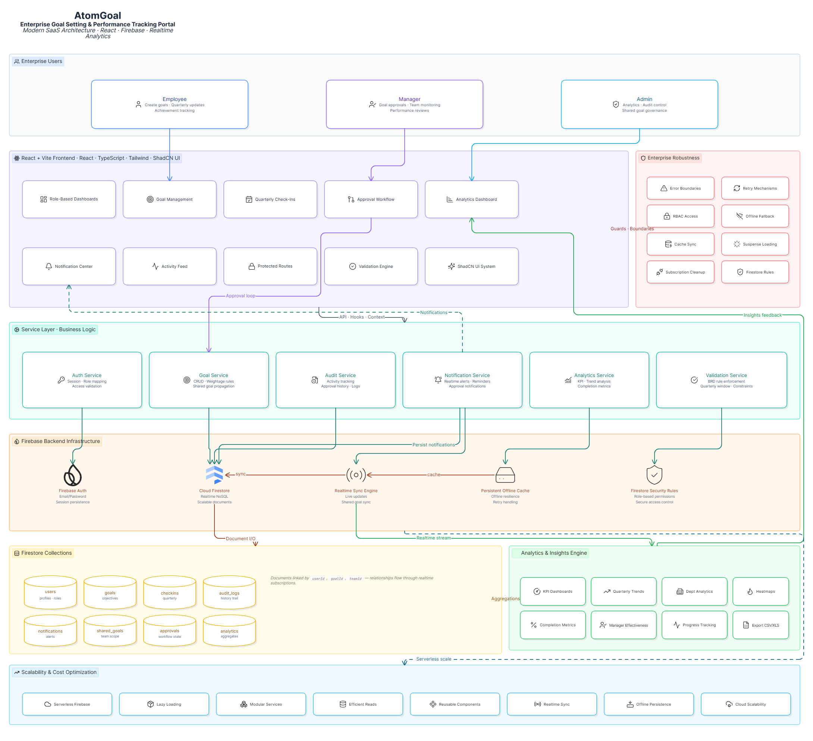

# AtomGoal Architecture

**AtomGoal - Enterprise Goal Setting & Performance Tracking Portal**
Modern SaaS Architecture built with React, Firebase, and Realtime Analytics.

## Overview
AtomGoal is designed using a modern, scalable n-tier architecture tailored for enterprise environments. It separates user interfaces, business logic services, and robust backend infrastructure to ensure high availability, security, and performance.

## Layers

### 1. Enterprise Users (Roles)
- **Employee**: Creates goals, provides quarterly updates, and tracks achievement.
- **Manager**: Responsible for goal approvals, team monitoring, and performance reviews.
- **Admin**: Manages analytics, audit controls, and shared goal governance.

### 2. Frontend Layer (React + Vite + Tailwind + ShadCN UI)
The presentation layer is built for performance and responsive design. Key components include:
- Role-Based Dashboards
- Goal Management & Quarterly Check-ins
- Approval Workflow
- Analytics Dashboard
- Notification Center & Activity Feed
- Protected Routes & Validation Engine

### 3. Service Layer (Business Logic)
This layer acts as the intermediary between the frontend and the backend data store, encapsulating core business rules:
- **Auth Service**: Session and role-mapping, access validation.
- **Goal Service**: CRUD operations, weightage rules, shared goal propagation.
- **Audit Service**: Activity tracking and approval history logs.
- **Notification Service**: Realtime alerts, reminders, and approval notifications. Persists notifications to Firestore.
- **Analytics Service**: KPI and trend analysis, completion metrics.
- **Validation Service**: Enforces BRD rules and quarterly window constraints.

### 4. Firebase Backend Infrastructure
The robust, serverless infrastructure powered by Firebase:
- **Firebase Auth**: Manages email/password authentication and session persistence.
- **Cloud Firestore**: Realtime NoSQL scalable document store.
- **Realtime Sync Engine**: Built-in live updates and shared goal sync via Firestore SDK.
- **Persistent Offline Cache**: Provides offline resilience and retry handling.
- **Firestore Security Rules**: Role-based permissions and secure access control.

### 5. Data Model (Firestore Collections)
- `users`: Profiles and roles.
- `goals`: Objectives.
- `checkins`: Quarterly updates.
- `audit_logs`: History trail.
- `notifications`: Alerts.
- `shared_goals`: Team scope goals.
- `approvals`: Workflow states.
- `analytics`: Aggregated data.

### 6. Analytics & Insights Engine
A dedicated engine processing data from Firestore to power the Analytics Dashboard via an insights feedback loop:
- KPI Dashboards & Quarterly Trends
- Department Analytics & Heatmaps
- Completion Metrics & Manager Effectiveness
- Progress Tracking & Export (CSV/XLS)

## Enterprise Robustness & Scalability
The platform is built to enterprise standards, featuring:
- **Robustness**: Error boundaries, retry mechanisms, strict RBAC access, offline fallback, cache sync, suspense loading, subscription cleanup, and stringent Firestore rules.
- **Scalability**: Serverless Firebase architecture, lazy loading, modular services, efficient database reads, reusable components, and real-time syncing.
